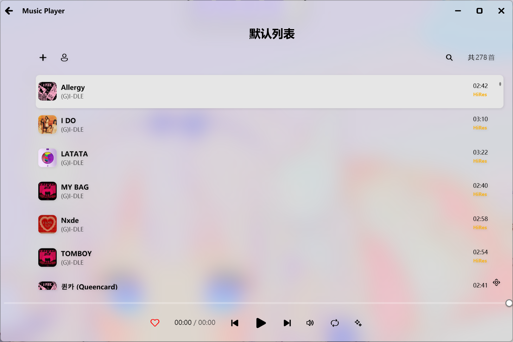
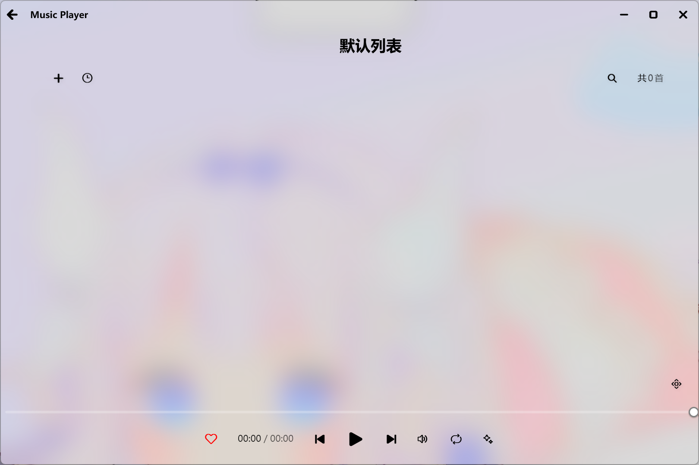
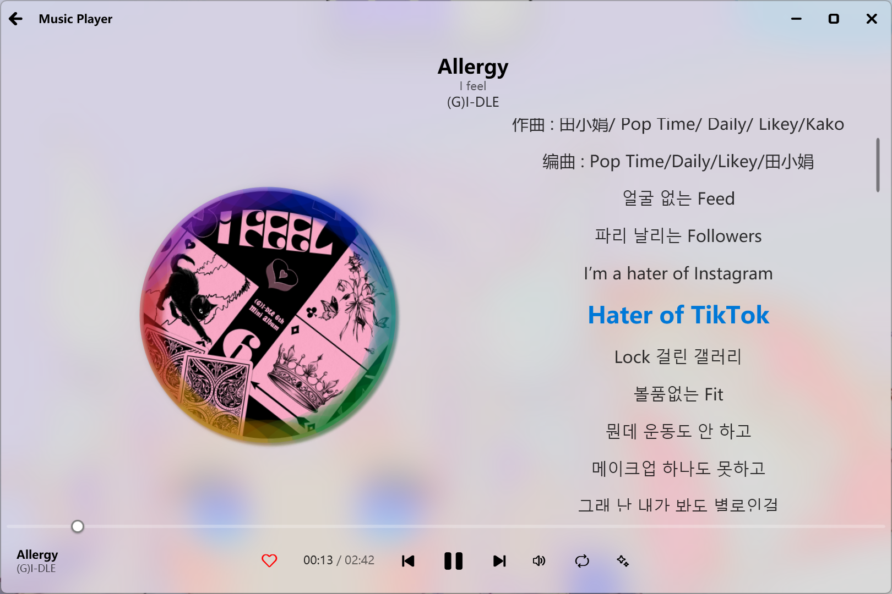
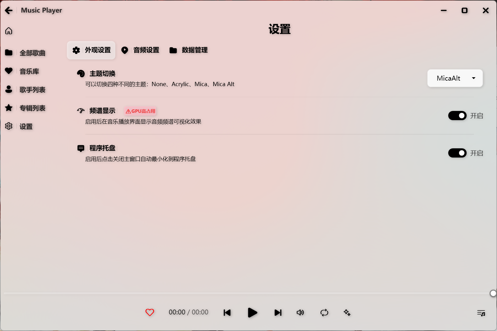
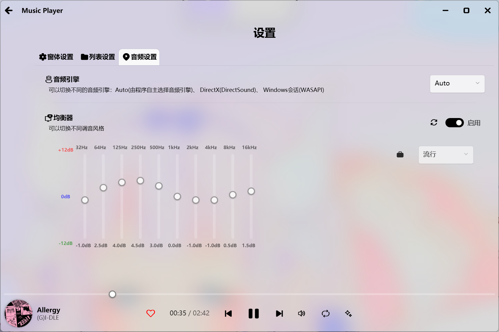
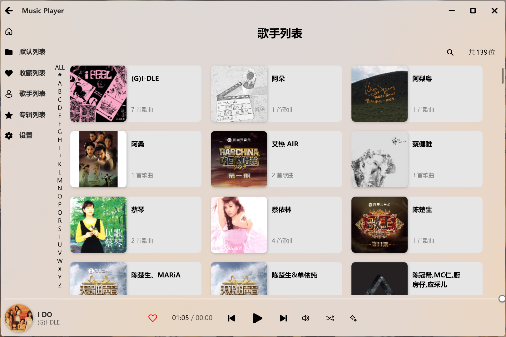
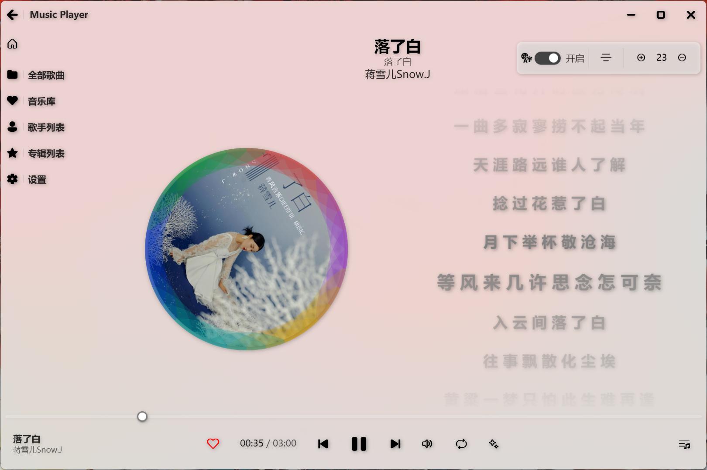
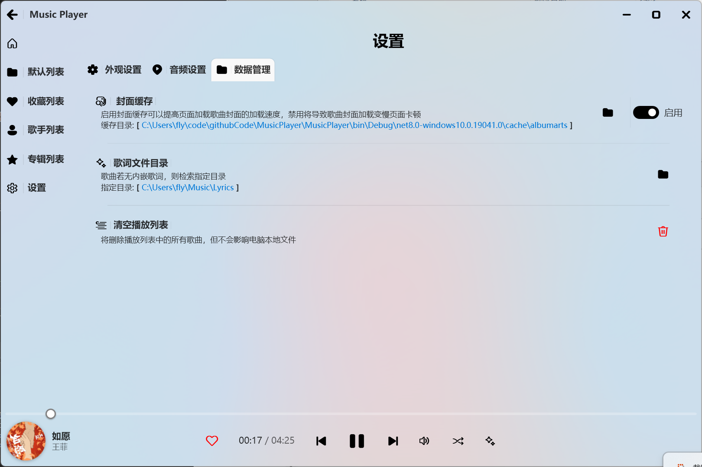
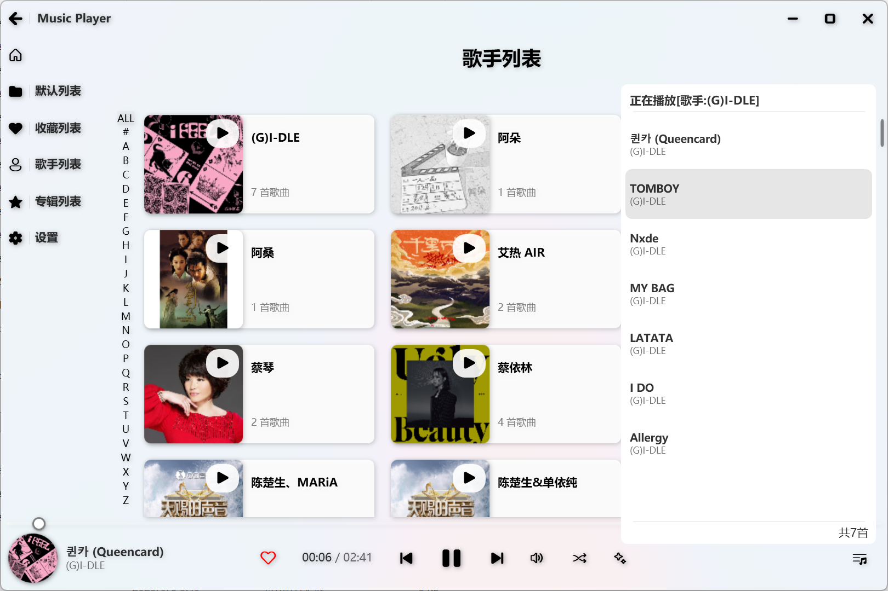

# 🎵 MusicPlayer


## ✨ 主要特性

### 🎧 音频播放功能
- **多格式支持**: MP3, WAV, FLAC, OGG/Vorbis 等主流音频格式
- **完整播放控制**: 播放/暂停/停止、上一首/下一首、进度跳转、快进/快退
- **音频信息展示**: 显示歌曲标题、艺术家、专辑信息和专辑封面
- **音频可视化**: 实时频谱分析器，提供线形和环形两种视觉反馈模式
- **系统媒体控制**: 集成 Windows 系统媒体传输控制 (SMTC)，支持系统级媒体控制
- **均衡器支持**: 多频段均衡器，提供多种预设和自定义调节
- **歌词显示**: 支持歌词文件加载和同步显示
- **收藏功能**: 支持歌曲收藏和收藏列表管理

### 📚 播放列表管理
- **本地音乐导入**: 支持单文件或批量导入音乐文件
- **搜索筛选**: 快速搜索和筛选播放列表中的歌曲
- **智能元数据**: 自动读取音乐文件的元数据信息
- **数据持久化**: 本地SQLite数据库存储播放列表信息
- **灵活排序**: 支持按添加时间、标题、艺术家、专辑、时长、文件大小等多种规则排序
- **播放列表缓存**: 智能缓存机制，提高大量歌曲场景下的响应速度
- **歌曲管理**: 支持歌曲删除、收藏等操作

### 🎨 现代化界面
- **Fluent Design**: 采用 WPF-UI 库实现的 Fluent Design 设计语言
- **自定义控件**: 模块化控件设计，包括标题栏、控制栏、播放列表等
- **响应式布局**: 自适应窗口大小变化
- **系统托盘**: 最小化到系统托盘，支持托盘菜单和快捷操作
- **歌词窗口**: 独立的歌词显示窗口，支持与主窗口同步

### ⚙️ 设置与配置
- **播放设置**: 音量控制、播放模式（顺序播放、单曲循环、列表循环、随机播放）
- **频谱设置**: 可启用/禁用频谱分析显示，支持线形和环形两种模式
- **均衡器设置**: 多频段均衡器调节，预设管理和自定义保存
- **音频引擎**: 支持多种音频引擎选择和配置
- **窗口行为**: 可配置关闭窗口时是完全退出还是最小化到托盘
- **播放列表设置**: 自定义播放列表显示和行为
- **配置持久化**: 所有设置自动保存到本地SQLite数据库

### 🏗️ 分层架构设计
- **核心层 (MusicPlayer.Core)**: 包含数据模型、服务接口定义、音频处理组件和数据访问层
- **服务层 (MusicPlayer.Services)**: 业务逻辑服务实现，包括播放器服务、配置服务、消息处理等
- **表现层 (MusicPlayer)**: WPF 用户界面、视图模型和自定义控件
- **依赖注入**: 使用 Microsoft.Extensions.DependencyInjection 进行服务管理和生命周期控制
- **消息通信**: 基于消息模式的松耦合组件通信机制
- **日志系统**: 基于 Serilog 的结构化日志系统，支持异步写入和文件轮转

## 📱 界面预览

### 默认播放列表


### 空列表状态


### 音频可视化效果


### 关闭频谱显示


### 设置界面


### 音频设置


### 歌手列表


### 歌词调节
- 任意歌词行单击鼠标右键触发


### 数据管理


  ### 播放队列
 

## 🏗️ 技术架构

### 核心技术栈
- **开发框架**: C# + WPF (.NET 8.0)
- **UI 框架**: [WPF-UI 4.1.0](https://github.com/lepoco/wpfui) - 现代化 WPF UI 组件库
- **音频处理**: [NAudio 2.2.1](https://github.com/naudio/NAudio) + NAudio.Vorbis 1.5.0
- **元数据处理**: [TagLibSharp 2.3.0](https://github.com/mono/taglib-sharp)
- **MVVM 框架**: CommunityToolkit.Mvvm 8.4.0
- **依赖注入**: Microsoft.Extensions.DependencyInjection 10.0.0
- **日志系统**: Serilog 4.2.0 + Serilog.Sinks.File 6.0.0 + Serilog.Sinks.Async 2.1.0
- **系统托盘**: Hardcodet.NotifyIcon.Wpf 2.0.1
- [网格布局（VirtualizingWrapPanel）](https://github.com/sbaeumlisberger/VirtualizingWrapPanel)  
  （注：截至 2026-01-18，NuGet 上尚未提供支持  .NET 8 的 VirtualizingWrapPanel 2.4.1 版本。因此，本项目基于其官方源码（commit: [f5bd4c5f]）编译为程序集直接引用。  
  **未对原始代码做任何修改**，仅用于启用虚拟化网格布局功能。  
  一旦官方发布兼容的 NuGet 包，将立即切换回标准 NuGet 引用方式。）

### 架构模式
- **设计模式**: MVVM (Model-View-ViewModel)
- **分层架构**: 核心层与表现层分离，提高代码可维护性
- **服务定位器**: 使用 ServiceLocator 模式进行服务管理
- **事件通信**: 通过消息服务实现组件间通信

## 📦 项目结构

```
MusicPlayer/
├── MusicPlayer.sln                 # 解决方案文件
├── MusicPlayer.Core/               # 核心层项目
│   ├── MusicPlayer.Core.csproj     # 核心项目配置
│   ├── Audio/                      # 音频处理模块
│   │   ├── EqualizerFilter.cs      # 均衡器过滤器
│   │   ├── EqualizerStream.cs      # 均衡器流
│   │   ├── SpectrumAnalyzer.cs     # 频谱分析器
│   │   └── VorbisAudioFileReader.cs # OGG 格式音频读取器
│   ├── Data/                       # 数据访问层
│   │   ├── ConfigurationDAL.cs     # 配置数据访问
│   │   ├── DBHelper.cs             # 数据库帮助类
│   │   ├── EqualizerPresetsDAL.cs  # 均衡器预设数据访问
│   │   └── PlaylistDataDAL.cs      # 播放列表数据访问
│   ├── Enums/                      # 枚举定义
│   │   ├── AudioEngine.cs          # 音频引擎枚举
│   │   ├── DataChangeType.cs       # 数据变更类型
│   │   ├── IconKind.cs             # 图标类型枚举
│   │   ├── PlayMode.cs             # 播放模式枚举
│   │   ├── SortRule.cs             # 排序规则枚举
│   │   └── Theme.cs                # 主题枚举
│   ├── Interface/                  # 服务接口定义
│   │   ├── IConfigurationService.cs # 配置服务接口
│   │   ├── IDialogService.cs       # 对话框服务接口
│   │   ├── IDispatcherService.cs   # 调度器服务接口
│   │   ├── IEqualizerPresetRepository.cs # 均衡器预设仓储接口
│   │   ├── IEqualizerService.cs    # 均衡器服务接口
│   │   ├── IMessagingService.cs    # 消息服务接口
│   │   ├── INotificationService.cs # 通知服务接口
│   │   ├── IPlayerService.cs       # 播放器服务接口
│   │   ├── IPlayerStateService.cs  # 播放状态服务接口
│   │   ├── IPlaylistCacheService.cs # 播放列表缓存服务接口
│   │   ├── IPlaylistDataService.cs # 播放列表数据服务接口
│   │   ├── IPlaylistService.cs     # 播放列表服务接口
│   │   ├── IServiceCoordinator.cs  # 服务协调器接口
│   │   ├── IStateUpdater.cs        # 状态更新器接口
│   │   ├── ISystemMediaTransportService.cs # 系统媒体传输服务接口
│   │   └── ITimerService.cs        # 定时器服务接口
│   ├── Models/                     # 数据模型
│   │   ├── EqualizerPreset.cs      # 均衡器预设模型
│   │   ├── EqualizerSettings.cs    # 均衡器设置模型
│   │   ├── ErrorInfo.cs            # 错误信息模型
│   │   ├── LyricLine.cs            # 歌词行模型
│   │   ├── Paths.cs                # 路径管理类
│   │   ├── PlayerConfiguration.cs  # 播放器配置模型
│   │   ├── PlayerStatusInfo.cs     # 播放状态信息模型
│   │   ├── PlayerStatusResponse.cs # 播放状态响应模型
│   │   ├── Song.cs                 # 歌曲信息模型
│   │   └── SortOption.cs           # 排序选项模型
├── MusicPlayer.Services/           # 服务层项目
│   ├── MusicPlayer.Services.csproj # 服务项目配置
│   ├── Handlers/                   # 消息处理器
│   │   ├── PlayerControlMessageHandler.cs # 播放控制消息处理器
│   │   ├── PlaylistMessageHandler.cs # 播放列表消息处理器
│   │   └── SystemMessageHandler.cs # 系统消息处理器
│   ├── Messages/                   # 消息定义
│   │   ├── ApplicationMessages.cs  # 应用程序消息
│   │   ├── AudioEngineChangedMessage.cs # 音频引擎变更消息
│   │   ├── CloseLyricsWindowMessage.cs # 关闭歌词窗口消息
│   │   ├── ErrorHandlingMessages.cs # 错误处理消息
│   │   ├── PlaybackMessages.cs      # 播放消息
│   │   ├── PlaylistMessages.cs     # 播放列表消息
│   │   ├── SavePresetFocusRequestMessage.cs # 保存预设焦点请求消息
│   │   ├── ServiceCoordinatorMessages.cs # 服务协调器消息
│   │   ├── SongDeletionMessages.cs # 歌曲删除消息
│   │   ├── SongFavoriteMessages.cs # 歌曲收藏消息
│   │   ├── SystemMessages.cs       # 系统消息
│   │   ├── VolumeMessages.cs       # 音量消息
│   │   └── WindowMessages.cs       # 窗口消息
│   └── Services/                   # 服务实现
│       ├── AlbumArtViewportService.cs # 专辑封面视口服务
│       ├── ConfigurationService.cs # 配置服务实现
│       ├── DialogService.cs        # 对话框服务实现
│       ├── DispatcherService.cs    # 调度器服务实现
│       ├── EqualizerPresetInitializationService.cs # 均衡器预设初始化服务
│       ├── EqualizerPresetRepository.cs # 均衡器预设仓储实现
│       ├── EqualizerService.cs      # 均衡器服务实现
│       ├── ErrorHandlingService.cs # 错误处理服务实现
│       ├── LifecycleManagementService.cs # 生命周期管理服务
│       ├── MemoryMonitorService.cs # 内存监控服务实现
│       ├── MessagingService.cs     # 消息服务实现
│       ├── NotificationService.cs  # 通知服务实现
│       ├── PlayerService.cs        # 播放器服务实现
│       ├── PlayerStateService.cs   # 播放状态服务实现
│       ├── PlaylistCacheService.cs # 播放列表缓存服务实现
│       ├── PlaylistCommandHandler.cs # 播放列表命令处理器
│       ├── PlaylistDataService.cs # 播放列表数据服务实现
│       ├── PlaylistService.cs      # 播放列表服务实现
│       ├── ServiceCoordinator.cs   # 服务协调器实现
│       ├── TimerService.cs         # 定时器服务实现
│       └── WindowManagerService.cs # 窗口管理服务实现
├── MusicPlayer/                    # 表现层项目
│   ├── MusicPlayer.csproj          # 主项目配置
│   ├── App.xaml/cs                 # 应用程序入口
│   ├── MainWindow.xaml/cs          # 主窗口界面
│   ├── LyricsWindow.xaml/cs        # 歌词窗口
│   ├── Config/                     # 应用程序配置
│   │   ├── ApplicationInitializationService.cs # 应用初始化服务
│   │   ├── AppStartup.cs           # 应用启动类
│   │   ├── ServiceCollectionExtensions.cs # 服务集合扩展
│   │   ├── SpectrumAnalyzerManager.cs # 频谱分析器管理器
│   │   ├── ViewModelLifecycleManager.cs # 视图模型生命周期管理器
│   │   └── WpfApplicationExtensions.cs # WPF应用扩展
│   ├── Controls/                   # 自定义控件
│   │   ├── BackgroundControl.xaml/cs # 背景控件
│   │   ├── CenterContentControl.xaml/cs # 中心内容控件
│   │   ├── CircularSpectrumControl.xaml/cs # 环形频谱控件
│   │   ├── ControlBarControl.xaml/cs # 控制栏控件
│   │   ├── PlaylistControl.xaml/cs # 播放列表控件
│   │   ├── PlaylistSettingControl.xaml/cs # 播放列表设置控件
│   │   ├── SettingsBarControl.xaml/cs # 设置栏控件
│   │   ├── SoundSettingsControl.xaml/cs # 声音设置控件
│   │   ├── SpectrumAnalyzerControl.xaml/cs # 频谱分析控件
│   │   ├── TitleBarControl.xaml/cs # 标题栏控件
│   │   └── WindowSettingsControl.xaml/cs # 窗口设置控件
│   ├── Converters/                 # WPF 值转换器
│   │   ├── AlbumArtConverter.cs    # 专辑封面转换器
│   │   ├── AudioEngineToStringConverter.cs # 音频引擎到字符串转换器
│   │   ├── AudioFormatToVisibilityConverter.cs # 音频格式到可见性转换器
│   │   ├── BlurEffectConverter.cs  # 模糊效果转换器
│   │   ├── BooleanConverter.cs      # 布尔转换器
│   │   ├── BooleanToVisibilityConverter.cs # 布尔到可见性转换器
│   │   ├── BoolToFavoriteTextConverter.cs # 布尔到收藏文本转换器
│   │   ├── BoolToIconConverter.cs  # 布尔到图标转换器
│   │   └── BoolToVisibilityConverter.cs # 布尔到可见性转换器
│   ├── ViewModels/                 # 视图模型
│   │   ├── BackgroundViewModel.cs  # 背景视图模型
│   │   ├── CenterContentViewModel.cs # 中心内容视图模型
│   │   ├── ControlBarViewModel.cs  # 控制栏视图模型
│   │   ├── LyricsViewModel.cs       # 歌词视图模型
│   │   ├── LyricsViewModelFactory.cs # 歌词视图模型工厂
│   │   ├── MainViewModel.cs        # 主视图模型
│   │   ├── ObservableObject.cs     # MVVM 基类
│   │   ├── PlaylistSettingViewModel.cs # 播放列表设置视图模型
│   │   ├── PlaylistViewModel.cs    # 播放列表视图模型
│   │   ├── SettingsBarViewModel.cs # 设置栏视图模型
│   │   ├── SettingsPageViewModel.cs # 设置页面视图模型
│   │   ├── SoundSettingsViewModel.cs # 声音设置视图模型
│   │   ├── SpectrumAnalyzerViewModel.cs # 频谱分析视图模型
│   │   ├── TitleBarViewModel.cs    # 标题栏视图模型
│   │   └── WindowSettingsViewModel.cs # 窗口设置视图模型
│   └── resources/                  # 资源文件
│       └── MusicPlayer.ico         # 应用图标
├── MusicPlayer_Install/            # 安装包项目
│   ├── MusicPlayer_Install.wapproj # 安装包配置
│   ├── Package.appxmanifest        # 应用清单
│   └── Images/                     # 安装包图片资源
├── Image/                          # 项目图片资源
└── README.md                       # 项目说明文档
```

## 🚀 快速开始

### 环境要求
- **操作系统**: Windows 10/11
- **开发环境**: .NET 8.0 SDK
- **IDE**: Visual Studio 2022 或 VS Code


## 🎯 使用指南

### 基本操作
1. **导入音乐**: 点击"导入音乐"按钮，选择单个或多个音乐文件（ctrl+a 全选）
2. **播放音乐**: 双击歌曲列表中的歌曲开始播放
3. **播放控制**: 使用底部播放控制面板进行播放/暂停/切换操作
4. **搜索歌曲**: 在搜索框中输入关键词快速查找歌曲
5. **切换设置**: 点击设置按钮进入设置页面配置播放器

### 高级功能
- **音频可视化**: 播放时歌曲封面会环绕显示实时音频频谱效果，可在设置中启用/禁用
- **智能元数据**: 自动读取音乐文件的标题、艺术家、专辑信息
- **系统媒体控制**: 支持使用键盘媒体键或系统通知区域的媒体控制按钮

### 数据存储
- 播放列表信息本地存储在 LiteDB 数据库文件中(懒狗不想写sql,不想处理关系映射)
- 播放器配置、均衡器预设等设置存储在 LiteDB 数据库中
- 歌曲封面缓存保存在程序目录中的 cache 文件夹中
- 程序采用绿色便携设计，所有数据都保存在程序目录


## 🔧 开发说明

### 核心组件

#### 分层架构设计
- **核心层 (MusicPlayer.Core)**: 定义数据模型、服务接口、音频处理组件和数据访问层，提供独立于UI的业务逻辑
- **服务层 (MusicPlayer.Services)**: 实现业务逻辑服务，包括播放器服务、配置服务、消息处理、错误处理等
- **表现层 (MusicPlayer)**: 实现WPF界面和视图模型，处理用户交互和界面渲染
- **依赖注入**: 使用Microsoft.Extensions.DependencyInjection管理服务生命周期和依赖关系

#### 主要服务组件
- **PlayerService**: 音频播放核心服务，处理音频文件的解码和播放控制
- **PlayerStateService**: 播放状态管理，处理播放状态切换和进度跟踪
- **PlaylistService**: 播放列表核心服务，提供数据持久化和元数据读取功能
- **PlaylistDataService**: 播放列表数据服务，处理歌曲的增删改查操作
- **PlaylistCacheService**: 播放列表缓存服务，提高大量歌曲场景下的响应速度
- **ConfigurationService**: 配置管理服务，处理播放器配置的读写操作
- **EqualizerService**: 均衡器服务，处理音频均衡效果的调节和应用
- **NotificationService**: 系统通知服务，提供各种类型的用户通知
- **SystemMediaTransportService**: 系统媒体传输服务，集成Windows系统媒体控制
- **ErrorHandlingService**: 错误处理服务，统一处理应用程序中的异常情况
- **LifecycleManagementService**: 生命周期管理服务，管理应用程序的启动和关闭流程
- **MemoryMonitorService**: 内存监控服务，监控应用程序的内存使用情况

#### 消息通信机制
- **消息服务**: 基于IMessagingService实现组件间的松耦合通信
- **消息处理器**: 专门的消息处理器处理特定类型的消息，提高代码组织性
- **事件驱动**: 通过消息传递处理播放状态变更、歌曲切换等事件
- **命令模式**: 使用ICommand实现界面操作的响应式处理

#### 自定义控件系统
- **模块化设计**: 将界面拆分为TitleBar、ControlBar、Playlist、CenterContent等独立控件
- **MVVM模式**: 使用视图模型和接口实现控件的可测试性和可维护性
- **数据绑定**: 实现数据与界面的双向绑定和值转换
- **样式管理**: 通过WPF-UI和自定义样式统一管理界面外观和动画效果

#### 日志系统
- **Serilog集成**: 基于Serilog的结构化日志系统，支持多种输出目标
- **异步写入**: 使用Serilog.Sinks.Async避免UI阻塞
- **日志轮转**: 自动管理日志文件大小和保留期限
- **分级记录**: 支持不同级别的日志记录，便于调试和问题排查

### 依赖包说明
- **WPF-UI**: 提供 Fluent Design 风格的现代 WPF 控件
- **NAudio**: 强大的 .NET 音频处理库，支持多种音频格式
- **NAudio.Vorbis**: OGG/Vorbis 格式音频文件支持
- **TagLibSharp**: 音频文件元数据读取（标题、艺术家、封面等）
- **CommunityToolkit.Mvvm**: 轻量级MVVM框架，简化数据绑定和命令处理
- **Microsoft.Extensions.DependencyInjection**: 依赖注入容器，管理服务生命周期
- **Microsoft.Extensions.Hosting**: 主机应用程序基础设施，提供应用程序生命周期管理
- **Serilog**: 结构化日志框架，提供灵活的日志记录功能
- **Hardcodet.NotifyIcon.Wpf**: WPF系统托盘图标支持


## 🎉 致谢

- [WPF-UI](https://github.com/lepoco/wpfui) - 现代化 WPF UI 框架
- [NAudio](https://github.com/naudio/NAudio) - .NET 音频处理库
- [TagLib-Sharp](https://github.com/mono/taglib-sharp) - 多媒体元数据库

## 📚 参考项目

 
- [一个功能强大、界面现代的 C# WPF 本地音乐播放器](https://github.com/ceng10086/MusicPlayer.git)
- [🎵 原音 HQ 播放器（Original Sound HQ Player）🎶](https://github.com/Johnwikix/original-sound-hq-player.git)
- [音频可视化（SpectrumVisualization）](https://github.com/Johnwikix/SpectrumVisualization.git) 
- [Lemon-App](https://github.com/TwilightLemon/Lemon-App.git)
 

## 📄 许可证

本项目采用 LICENSE 许可证 - 查看 [LICENSE](LICENSE) 文件了解详情。